# Credit_Risk_Analysis
## Overview

## Results
### Random Oversampler Model

 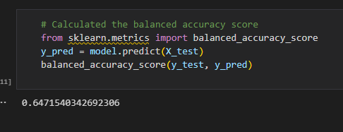 

 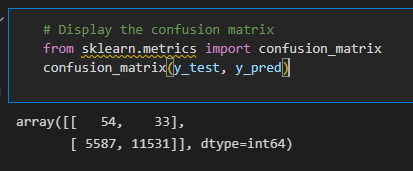 

 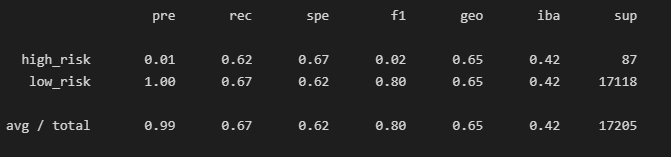 

### SMOTE Model

  

 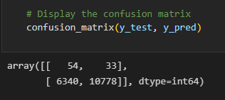 

 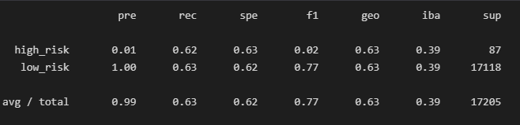 

### Cluster Centroids Model

 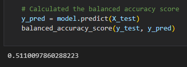 

 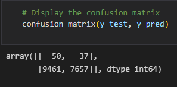 

 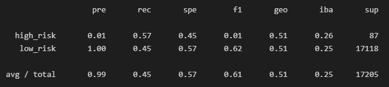 
  

### SMOTEENN Model

 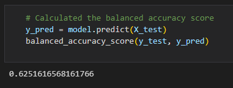 

 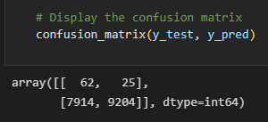 

 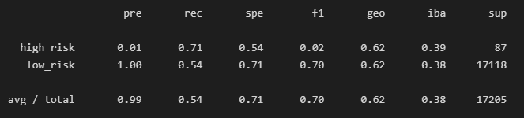 

  
### Balanced Random Forest Classifier Model

 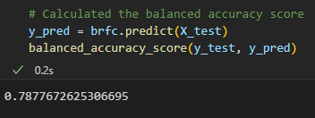 

 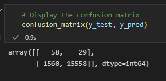 

 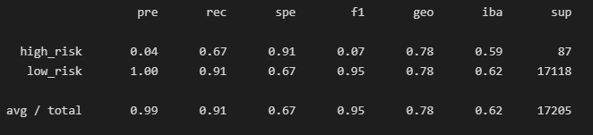 

### Easy Ensemble Classifier Model

 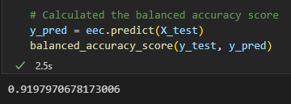 

 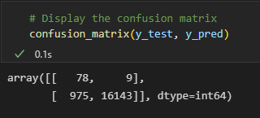 

 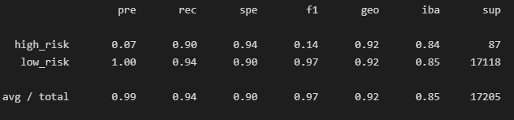 

## Summary 
